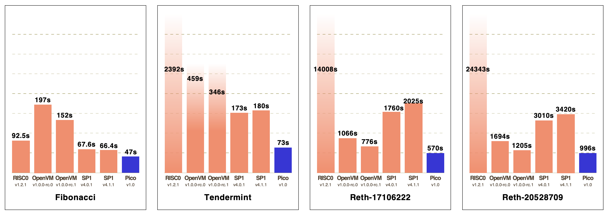

# zkvm-bench

This repository provides instructions for benchmarking four zkVMs: RISC0, OpenVM, SP1, and Pico.

Our initial benchmarks - detailed in our [blog post](https://blog.brevis.network/2025/02/11/introducing-pico-a-modular-and-performant-zkvm/) - compare all zkVMs under identical conditions: the same hardware (r7a.x48large), the same Rust program, and execution without compiler acceleration or custom parameters. This ensures a fair, apple-to-apple comparison, including for Pico.

Recognizing that teams may favor optimized settings, we also provide benchmarks tuned to each zkVM’s strengths. RISC0 and SP1 use configurations from their [`zkvm-perf`](https://github.com/succinctlabs/zkvm-perf) repository, while OpenVM uses settings from the [`openvm-reth-benchmark`](https://github.com/axiom-crypto/openvm-reth-benchmark) repository, enabling each to achieve its best possible CPU performance.

## Setup

Initialize the git sub-modules:
```shell
git submodule update --init --recursive
```

## Machine and OS

- AWS: `r7a.48xlarge` (192 CPUs)
- OS: `ubuntu-24.04-amd64-server`

## Process

- To benchmark RISC0, please follow instructions in [risc0/README](risc0/README.md)
- To benchmark OpenVM, please follow instructions in [openvm/README](openvm/README.md)
- To benchmark SP1, please follow instructions in [sp1/README](sp1/README.md)
- To benchmark Pico, please follow instructions in [pico/README](pico/README.md)

## Results
The aforementioned process will lead to the following results for various zkVMs.




